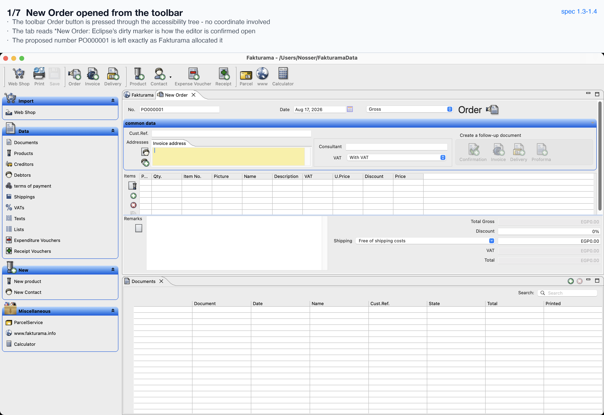
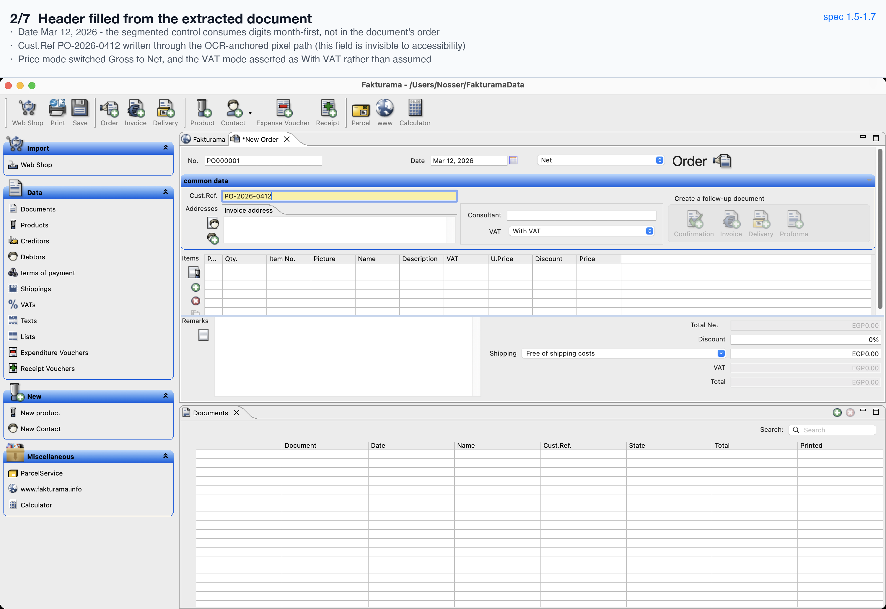
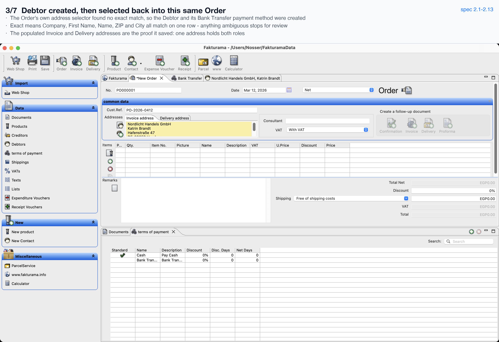
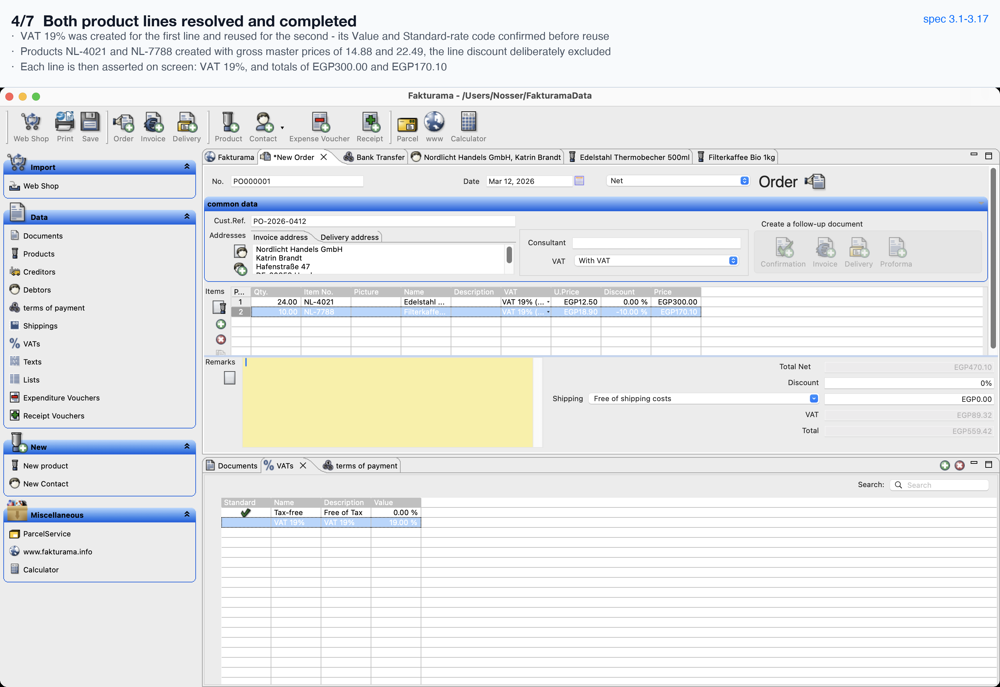
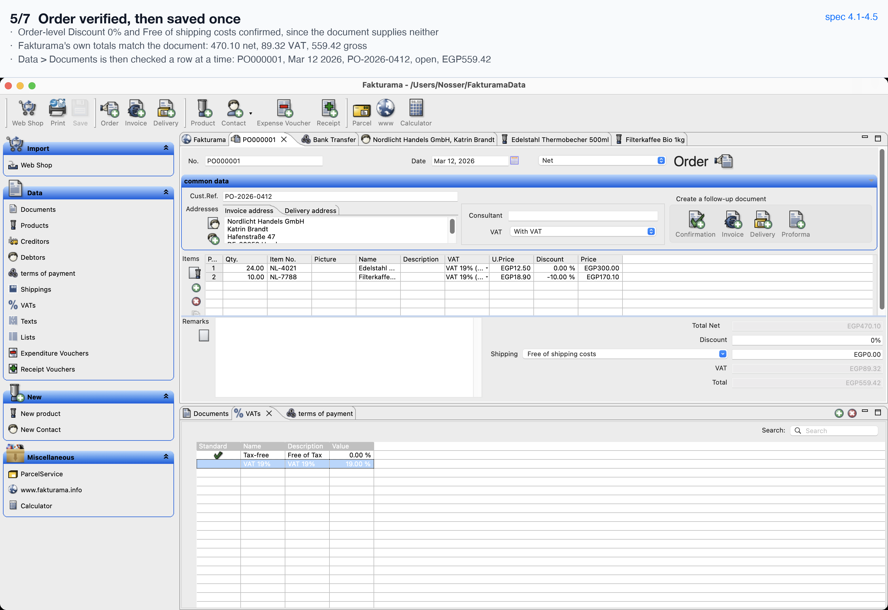
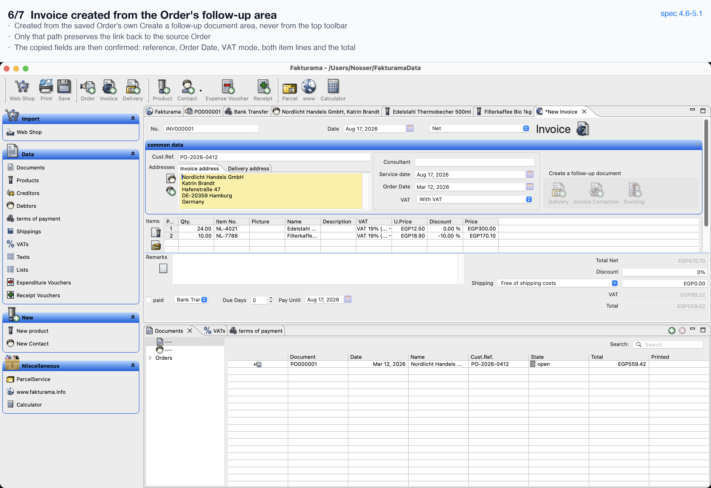
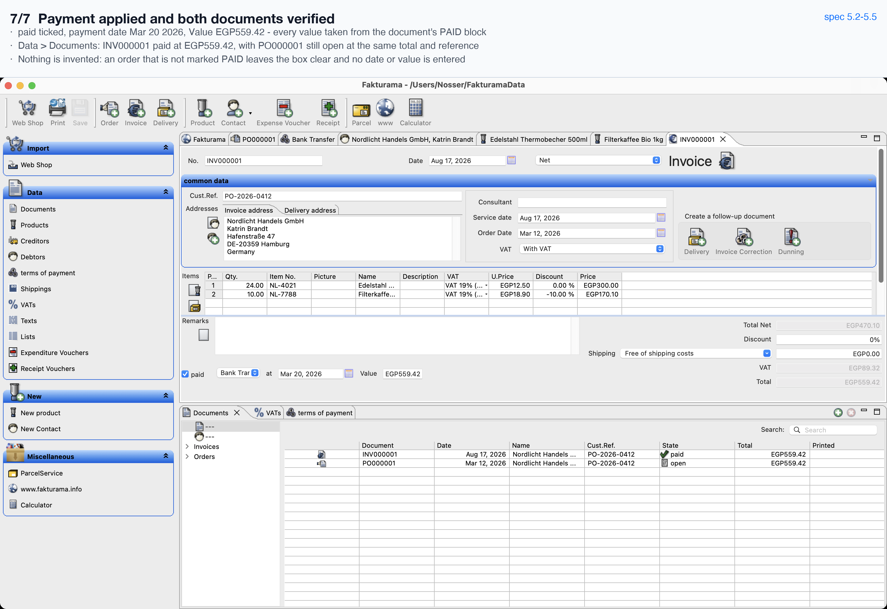

# One run, step by step

A single order image in, a saved Order and a linked paid Invoice out, starting
from an empty Fakturama database.

- **Input:** [`assets/sample_order.png`](../assets/sample_order.png)
- **Recording:** [`run.mp4`](run.mp4) — the Fakturama window for the whole run, at
  10× speed. Captured from the window's own backing store rather than the screen,
  so it shows the application and nothing else that was on the desktop.
- **Transcript:** [`run-log.json`](run-log.json) — every action and every
  verification, in order, as the run recorded them.

Each screenshot below is the one the run itself wrote to `runs/<timestamp>/` at
that step, with a caption bar added. `verified` lines quoted underneath are the
run's own log.

---

## 1. Open the Order first



```
[action  ] pressed toolbar 'Order'
[verified] New Order editor is open  {'region': '(524,155)-(1721,590)'}
```

The Order is opened *before* any master data is resolved, and its tab then stays
open for the whole run — every missing record is created elsewhere and selected
back into this tab.

---

## 2. Fill the header



```
[action  ] set date ~'^Date$' = 2026-03-12
[action  ] set field ~'^Cust.?Ref' = 'PO-2026-0412'
[verified] document price mode is Net
[verified] document VAT mode is `With VAT`
```

Neither of those fields exists as far as the accessibility tree is concerned:
both are addressed as "the input to the right of this label", from a fresh
screenshot each time.

---

## 3. Debtor: no match, so create — then select it back



```
[info    ] no exact Debtor match; will create one
[verified] created the payment method  {'method': 'Bank Transfer'}
[verified] created the Debtor  {'company': 'Nordlicht Handels GmbH'}
[verified] selected an existing Debtor
[verified] Invoice and Delivery addresses match the source document
```

The Order's own address selector is the existence check. A row only counts as an
exact match when Company, First Name, Name, ZIP and City all appear on it; two
candidates, or a conflicting one, stops the run for review instead of guessing.

---

## 4. Products: create what is missing, reuse what is not



```
[verified] created the VAT rate  {'name': 'VAT 19%'}
[verified] reusing an existing VAT rate  {'name': 'VAT 19%', 'value': '19', 'code': 'S (Standard rate)'}
[verified] created the Product  {'sku': 'NL-4021', 'gross_price': '14.88', 'vat': 'VAT 19%'}
[verified] created the Product  {'sku': 'NL-7788', 'gross_price': '22.49', 'vat': 'VAT 19%'}
[verified] line 1 carries the extracted VAT and totals as the document does
[verified] line 2 carries the extracted VAT and totals as the document does
```

The second line's rate is the one the first line created — and it is only reused
after its value and its `S (Standard rate)` E-Invoice code have been read off the
record itself.

---

## 5. Verify, then save once



```
[verified] order-level Discount is 0% and shipping is free
[verified] Order totals match the source document
[verified] save committed
[verified] Documents lists PO000001 dated 2026-03-12 with reference PO-2026-0412, state open and total 559.42
```

Save is pressed exactly once; the confirmation is Eclipse's dirty marker
disappearing from the tab, not the click returning.

---

## 6. The Invoice comes from the Order, not the toolbar



```
[action  ] pressed Invoice in the Order's follow-up area
[verified] Invoice inherited the Order's reference, date, VAT mode, lines and total
```

Only the follow-up action keeps the link back to the source Order, which is the
relationship the whole flow exists to produce.

---

## 7. Apply the payment status and verify both documents



```
[verified] Invoice payment method is correct  {'method': 'Bank Transfer'}
[verified] Invoice marked paid  {'date': '2026-03-20', 'value': '559.42'}
[verified] Documents lists Invoice INV000001 with reference PO-2026-0412, the extracted payment state and total 559.42
[verified] the source Order PO000001 is still listed as open with the same reference and total
[info    ] run complete  {'created': ['created the payment method', 'created the Debtor',
                                      'created the VAT rate', 'created the Product', 'created the Product']}
```

Both rows are checked whole: the panel holds the Order and the Invoice, so `paid`
and `open` mean nothing unless the row carrying each is identified.

The five creations on that last line are the five records that were genuinely
missing from an empty database — one payment method, one Debtor, one VAT rate and
two Products. The VAT rate appears once because the second line reused it.

---

## Second run: nothing gets created twice

```
python scripts/run.py assets/sample_order.png --expect-selection-only
```

The same image again, against the database the first run left behind. Transcript:
[`run-log-second-run.json`](run-log-second-run.json).

```
[verified] selected an existing Debtor   {'company': 'Nordlicht Handels GmbH'}
[verified] selected an existing Product  {'sku': 'NL-4021'}
[verified] selected an existing Product  {'sku': 'NL-7788'}
[info    ] run complete  {'created': []}
```

`created: []` is the assertion. Every master record was found through the Order's
own selectors, so the creation branches never ran — and `--expect-selection-only`
turns that into a non-zero exit if any of them had.

The new Order and Invoice are of course new documents, which is what makes this a
real test of the verification too: the list now holds several documents carrying
the *same* customer reference and the *same* total, so a check that was not scoped
to one identified row would pass on the wrong one.

---

*Provenance: the screenshots, the recording and `run-log.json` come from one run
against an empty database. `run-log-second-run.json` is the run immediately after
it. Both are unedited.*
